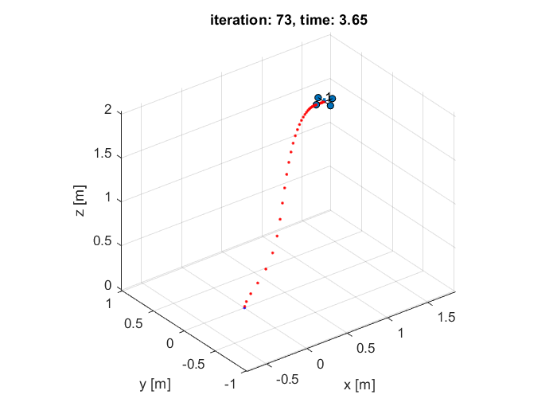
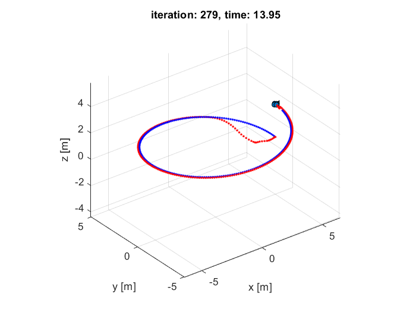
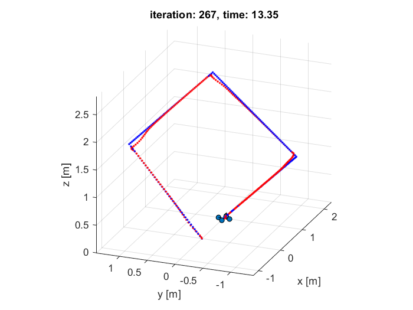
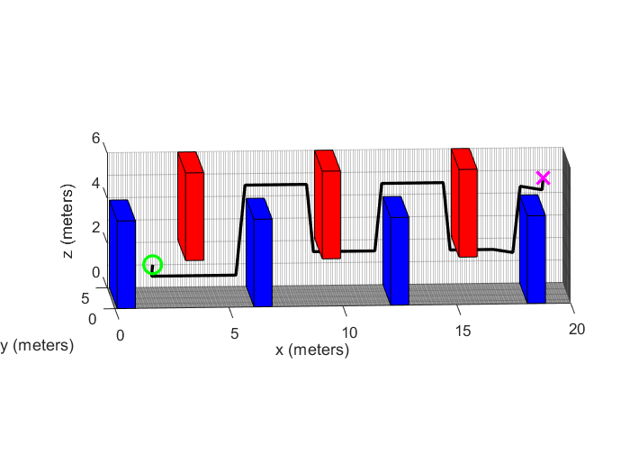
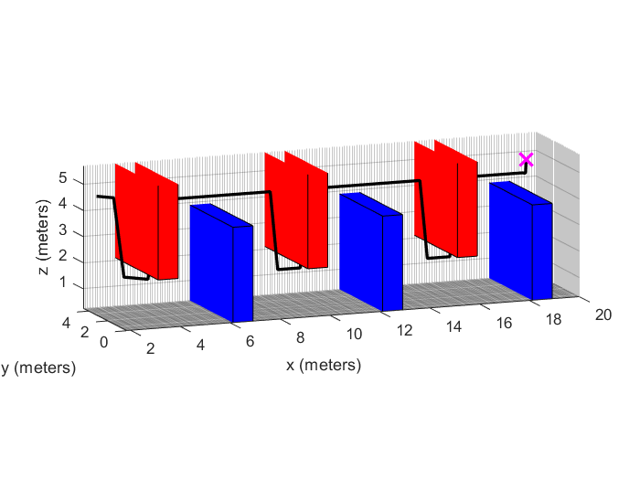

# Control and Path Planning of Quadrotor

## 1. Quadrotor Control Using Serial PD Controller

In this part of the project, a cascade PD controller was implemented to control the quadrotor to follow various trajectories. The control system regulates both position and orientation, ensuring that the quadrotor accurately tracks the reference path. Below are the simulation results from MATLAB for three different types of trajectories:

- **Hover Test:** In this test, the quadrotor maintains a stable hover at a fixed position.

  

- **Circle Trajectory:** The quadrotor follows a circular path, demonstrating its ability to track smooth curves.

  

- **Diamond Trajectory:** The quadrotor follows a diamond-shaped trajectory, which includes sharp turns.

  

## 2. Path Planning Algorithms

In the second part of the project, two path planning algorithms were implemented to guide the quadrotor from the start point to the goal through a grid-based environment with obstacles. These algorithms are:

- **Dijkstra Algorithm:** This algorithm finds the shortest path without considering heuristic information, ensuring optimality.
  
  

- **A* Algorithm:** This algorithm uses a heuristic to improve search efficiency while maintaining optimality.

  
